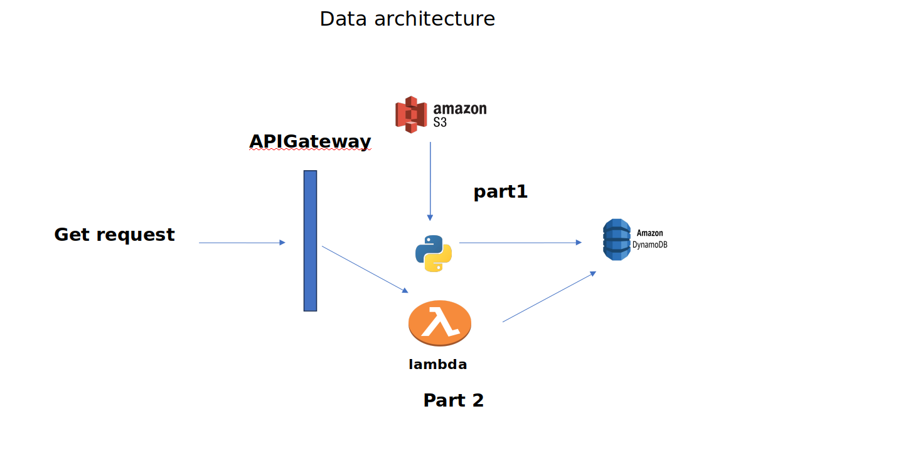

# ETL pipeline
## ▶️ Getting started

## part 1 Design and code a simple ETL (S3 python Dynamodb)

1. Check if you already have Node.js installed. Run this command in your terminal:

```bash
# install requirements (recommended)
pip install requirements.txt
```
2. build .env.dist file

aws_access_key_id = "your access key" <br>
aws_secret_access_key = "your secret key" <br>
bucket_name = "your bucket name" <br>
object_key = "s3 object key" <br>
table_name = "your Table Name" <br>
region = "your cloud region" <br>

3. install your csv or csvs in your S3 bucket 

<h5> data.csv </h5>

4. [build your S3 bucket and insert your data](https://aws.amazon.com/s3/)

5. [build your dynamodb connection and Roles](https://aws.amazon.com/dynamodb/)

6. run Tranform/main.py

## part 2 Design and code simple REST API 

1. build a lambda function or run directly from Makfile

2. build a dynamodb connection with the lambda function IAM Role

3. connect s3 with lambda IAM Role

4. Run Makefile 

5. test your API

## part 3 system diagram  AWS

S3 Bucket: This is an AWS storage service used to store files, in this case, a CSV file containing data.<br>

Lambda Function: A serverless compute service provided by AWS. It runs code in response to triggers, such as changes to data in an S3 bucket or HTTP requests via API Gateway. In this system, the Lambda function is triggered by an API Gateway request.<br>

DynamoDB: A fully managed NoSQL database service provided by AWS. It is used to store structured data, and it scales automatically based on demand. In this system, DynamoDB is the data store where the data from the CSV file is loaded.<br>

API Gateway: A fully managed service provided by AWS to create, deploy, and manage APIs. It acts as a front-end for the Lambda function, allowing it to be invoked via HTTP requests.<br>

CSV File: This is the source of data, stored in the S3 bucket. The Lambda function reads the CSV file from S3, processes its contents, and inserts the data into DynamoDB.<br>

HTTP Request: Clients make HTTP GET requests to the API Gateway endpoint. This triggers the Lambda function, which retrieves data from DynamoDB and returns it as an HTTP response.<br>

Lambda Function Invocation: When the API Gateway receives an HTTP request, it invokes the Lambda function associated with the requested resource. The Lambda function processes the request, interacts with DynamoDB to retrieve data, and returns the result.<br>

1. system demo


## Extra part  serverless framework

[serverless link](https://www.serverless.com/)

<h4>
With the Serverless Framework, we can swiftly orchestrate this infrastructure within minutes. Leveraging the framework's capabilities, we automate the provisioning and management of the entire stack, including the seamless integration of services such as API Gateway, AWS Lambda, and DynamoDB. This process requires minimal manual intervention, as it is primarily driven by the configuration defined in the serverless.yml file. By encapsulating infrastructure as code, we ensure consistent and reproducible deployments while streamlining the development lifecycle.
</h4>